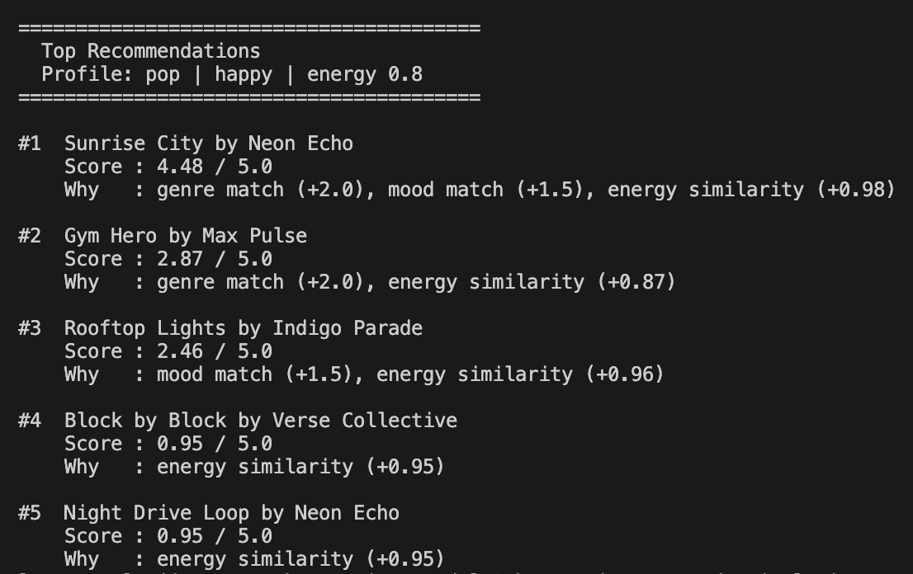

# 🎵 Music Recommender Simulation

## Project Summary

In this project you will build and explain a small music recommender system.

Your goal is to:

- Represent songs and a user "taste profile" as data
- Design a scoring rule that turns that data into recommendations
- Evaluate what your system gets right and wrong
- Reflect on how this mirrors real world AI recommenders

This project builds a content-based music recommender that scores songs against a user's stated preferences and returns the best matches with plain-language explanations. It uses a weighted scoring system based on genre, mood, energy, and acousticness across a catalog of 18 songs.

---

## How The System Works

Real platforms like Spotify use two main approaches: collaborative filtering (based on what similar users listened to) and content-based filtering (based on the song's own attributes like tempo or mood). This simulation uses content-based filtering only.

Each song has attributes including `genre`, `mood`, `energy`, `tempo_bpm`, `valence`, `danceability`, and `acousticness`. The `UserProfile` stores a user's `favorite_genre`, `favorite_mood`, `target_energy`, and whether they `likes_acoustic` music.

The recommender scores every song by checking how well it matches the user's profile, then returns the top-ranked results.

**Algorithm Recipe:**
- +2.0 points if the genre matches
- +1.5 points if the mood matches
- up to +1.0 points based on how close the song's energy is to the user's target
- up to +0.5 points for acousticness, but only if the user likes acoustic music

**Potential biases:** Because genre carries the most weight, a same-genre song with the wrong mood can still outscore a song that perfectly matches the mood but belongs to a different genre. The system might also over-prioritize genre and cause a "filter bubble", a chill jazz fan might never see a great ambient track even if the vibe is nearly identical.

---

## Getting Started

### Setup

1. Create a virtual environment (optional but recommended):

   ```bash
   python -m venv .venv
   source .venv/bin/activate      # Mac or Linux
   .venv\Scripts\activate         # Windows

2. Install dependencies

```bash
pip install -r requirements.txt
```

3. Run the app:

```bash
python -m src.main
```

### Running Tests

Run the starter tests with:

```bash
pytest
```

You can add more tests in `tests/test_recommender.py`.

---

## Sample Terminal Output



---

## Experiments You Tried

**Weight shift:** Halved the genre weight from 2.0 to 1.0 and doubled the energy weight from 1.0 to 2.0. This fixed the classical edge case where a slow song was ranked first for a high-energy user, but made genre-loyal profiles feel less accurate. The original weights were restored as the better default.

**Five user profiles tested:** High-Energy Pop, Chill Lofi, Deep Intense Rock, Classical Fan Wanting High Energy, and Conflicting Sad + High Energy. The lofi and rock profiles worked best. The conflicting profile exposed that the scorer adds up points without noticing when preferences contradict each other.

---

## Limitations and Risks

- Genre carries the most weight, which can push irrelevant songs to the top if the catalog only has one song in that genre.
- The system never recommends outside the user's stated genre, creating a filter bubble.
- With only 18 songs, niche-genre users run out of real matches quickly and get filler results.
- No context signals like time of day, activity, or listening history are considered.

See [model_card.md](model_card.md) for a full breakdown.

---

## Reflection

[**Model Card**](model_card.md)

Recommenders turn data into predictions by reducing taste to numbers and comparing them against a catalog. The tricky part is deciding which numbers matter most. Changing a single weight shifted the entire output, which shows how much human judgment goes into what feels like an automatic system. Bias shows up naturally when the dataset is uneven: genres with more songs get better results, and users whose preferences do not fit the catalog neatly end up with generic filler. A real platform hides this behind a much larger catalog, but the same problem exists at scale.
