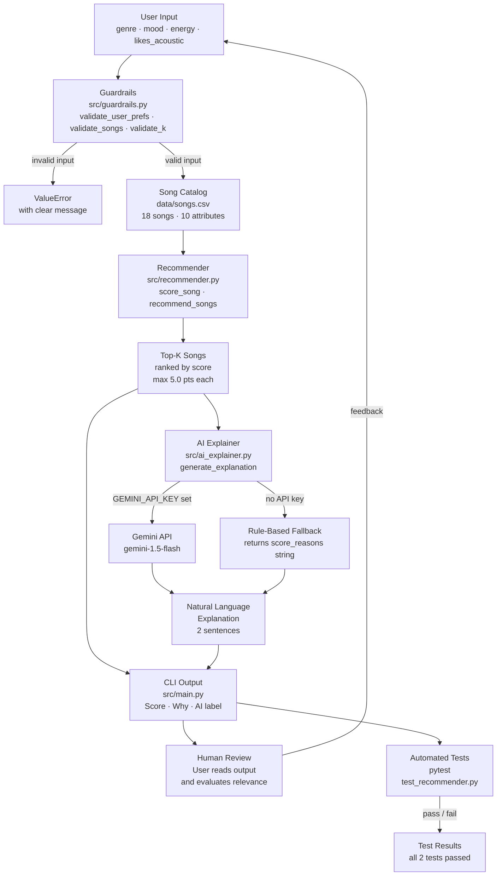

# VibeMatch 2.0 — System Architecture

## Component Summary

| File | Role |
|---|---|
| `src/main.py` | CLI entry point, loads data, runs profiles, prints output |
| `src/recommender.py` | Core scoring algorithm, `score_song` and `recommend_songs` |
| `src/guardrails.py` | Input validation, rejects malformed preferences before scoring |
| `src/ai_explainer.py` | Claude integration, converts scores into conversational explanations |
| `data/songs.csv` | Static song catalog, 18 songs across 11 genres |
| `.env` | Holds `GEMINI_API_KEY` (not committed to git) |

## Data Flow

1. `main.py` calls `load_songs("data/songs.csv")` and validates the catalog with `validate_songs`.
2. For each user profile, `validate_user_prefs` runs before scoring begins.
3. `recommend_songs` scores every song using `score_song` (genre, mood, energy, acoustic weights) and returns the top-k sorted results.
4. For each result, `generate_explanation` sends a short prompt to Claude Haiku and gets back a 2-sentence explanation. If the API is unavailable, it falls back to the rule-based reason string.
5. `main.py` prints the score, rule-based reasons, and AI explanation side by side.
6. The user reads the output and checks whether the recommendations make sense. This is the human review step.
7. `pytest` runs the automated test suite separately to verify the core scoring logic and explanation output.
