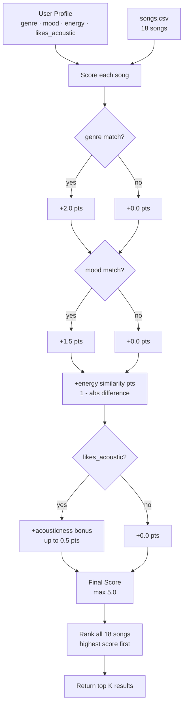

# Recommender Data Flow

```mermaid
flowchart TD
    A[User Profile\ngenre · mood · energy · likes_acoustic] --> C
    B[songs.csv\n18 songs] --> C[Score each song]
    C --> D{genre match?}
    D -- yes --> E[+2.0 pts]
    D -- no --> F[+0.0 pts]
    E --> G{mood match?}
    F --> G
    G -- yes --> H[+1.5 pts]
    G -- no --> I[+0.0 pts]
    H --> J[+energy similarity pts\n1 - abs difference]
    I --> J
    J --> K{likes_acoustic?}
    K -- yes --> L[+acousticness bonus\nup to 0.5 pts]
    K -- no --> M[+0.0 pts]
    L --> N[Final Score\nmax 5.0]
    M --> N
    N --> O[Rank all 18 songs\nhighest score first]
    O --> P[Return top K results]
```
